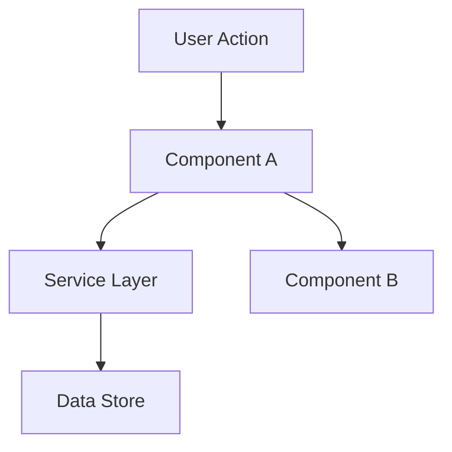

# Phase 2: Design

**Goal**: Define HOW to build it. Architecture, components, what to reuse.

## Process

### 1. Review Specification
Read `.specs/[feature]/spec.md` before designing.

### 2. Define Architecture
Overview of how components interact. Use mermaid diagrams when helpful.

### 3. Identify Code Reuse
**CRITICAL**: What existing code can we leverage? This saves tokens and reduces errors.

### 4. Define Components and Interfaces
Each component: Purpose, Location, Interfaces, Dependencies, What it reuses.

### 5. Define Data Models
If the feature involves data, define models before implementation.

---

## Template: `.specs/[feature]/design.md`

```markdown
# [Feature] Design

**Spec**: `.specs/[feature]/spec.md`
**Status**: Draft | Approved

---

## Architecture Overview

[Brief description of the architecture approach]



---

## Code Reuse Analysis

### Existing Components to Leverage

| Component | Location | How to Use |
|-----------|----------|------------|
| [Existing Component] | `src/path/to/file` | [Extend/Import/Reference] |
| [Existing Utility] | `src/utils/file` | [How it helps] |
| [Existing Pattern] | `src/patterns/file` | [Apply same pattern] |

### Integration Points

| System | Integration Method |
|--------|-------------------|
| [Existing API] | [How new feature connects] |
| [Database] | [How data connects to existing schemas] |

---

## Components

### [Component Name]

- **Purpose**: [What this component does - one sentence]
- **Location**: `src/path/to/component/`
- **Interfaces**: 
  - `methodName(param: Type): ReturnType` - [description]
  - `methodName(param: Type): ReturnType` - [description]
- **Dependencies**: [What it needs to function]
- **Reuses**: [Existing code this builds upon]

### [Component Name]

- **Purpose**: [What this component does]
- **Location**: `src/path/to/component/`
- **Interfaces**: 
  - `methodName(param: Type): ReturnType`
- **Dependencies**: [Dependencies]
- **Reuses**: [Existing code]

---

## Data Models (if applicable)

### [Model Name]

```typescript
interface ModelName {
  id: string;
  field1: string;
  field2: number;
  createdAt: Date;
}
```

**Relationships**: [How this relates to other models]

### [Model Name]

```typescript
interface AnotherModel {
  id: string;
  // ...
}
```

---

## Error Handling Strategy

| Error Scenario | Handling | User Impact |
|---------------|----------|-------------|
| [Scenario 1] | [How handled] | [What user sees] |
| [Scenario 2] | [How handled] | [What user sees] |

---

## Tech Decisions (only non-obvious ones)

| Decision | Choice | Rationale |
|----------|--------|-----------|
| [What we decided] | [What we chose] | [Why - brief] |
```

---

## Tips

- **Reuse is king** - Every component should reference existing patterns
- **Interfaces first** - Define contracts before implementation
- **Keep it visual** - Diagrams save 1000 words
- **Small components** - If component does 3+ things, split it
- **Confirm before Tasks** - User approves design before breaking into tasks
